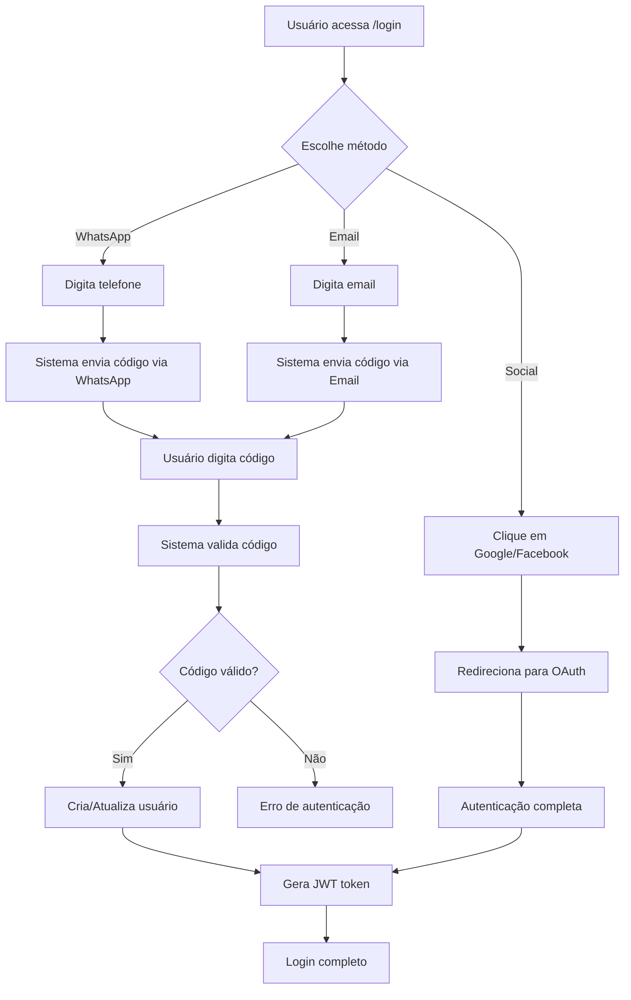

# Magic Login System - Documentação Técnica

## 1. Visão Geral

Sistema de autenticação sem senha (Magic Login) que permite aos usuários fazer login através de:
- Código único enviado por WhatsApp (via Evolution API)
- Código único enviado por email
- Login social (Google e Facebook via OmniAuth)

## 2. Arquitetura do Sistema

### 2.1 Componentes Principais

```
Frontend (React/TypeScript)
├── Página de Login (/login)
├── Página de Verificação de Código
├── Integração OAuth Social
└── Componentes de UI (Figma)

Backend (Rails 8 API)
├── Controllers (Grape)
│   ├── AuthController (/api/v1/auth)
│   ├── WhatsAppController (/api/v1/whatsapp)
│   └── OAuthController (/api/v1/oauth)
├── Serviços
│   ├── EvolutionConnection
│   ├── WhatsMessageService
│   ├── EmailService
│   └── OAuthService
├── Modelos
│   ├── User
│   ├── LoginCode
│   └── UserType
└── Jobs (Sidekiq)
    ├── SendCodeJob
    └── CleanupCodesJob
```

### 2.2 Fluxo de Autenticação



## 3. Modelos de Dados

### 3.1 Tabela users

```sql
CREATE TABLE users (
    id UUID PRIMARY KEY DEFAULT gen_random_uuid(),
    email VARCHAR(255) UNIQUE,
    phone VARCHAR(20),
    name VARCHAR(255),
    avatar_url TEXT,
    user_type_id UUID NOT NULL,
    provider VARCHAR(50), -- 'email', 'whatsapp', 'google', 'facebook'
    provider_uid VARCHAR(255),
    created_at TIMESTAMP WITH TIME ZONE DEFAULT NOW(),
    updated_at TIMESTAMP WITH TIME ZONE DEFAULT NOW(),
    last_login_at TIMESTAMP WITH TIME ZONE,
    login_count INTEGER DEFAULT 0
);

CREATE INDEX idx_users_email ON users(email);
CREATE INDEX idx_users_phone ON users(phone);
CREATE INDEX idx_users_provider ON users(provider, provider_uid);
```

### 3.2 Tabela user_types

```sql
CREATE TABLE user_types (
    id UUID PRIMARY KEY DEFAULT gen_random_uuid(),
    name VARCHAR(50) UNIQUE NOT NULL,
    description TEXT,
    hierarchy_level INTEGER NOT NULL,
    created_at TIMESTAMP WITH TIME ZONE DEFAULT NOW()
);

-- Tipos iniciais
INSERT INTO user_types (name, description, hierarchy_level) VALUES
('OG', 'Super Admin - Acesso total ao sistema', 1),
('client', 'Cliente - Usuário padrão do sistema', 2);
```

### 3.3 Tabela login_codes

```sql
CREATE TABLE login_codes (
    id UUID PRIMARY KEY DEFAULT gen_random_uuid(),
    user_id UUID,
    destination VARCHAR(255) NOT NULL, -- email ou telefone
    code VARCHAR(6) NOT NULL,
    method VARCHAR(20) NOT NULL, -- 'email' ou 'whatsapp'
    expires_at TIMESTAMP WITH TIME ZONE NOT NULL,
    used_at TIMESTAMP WITH TIME ZONE,
    attempts INTEGER DEFAULT 0,
    created_at TIMESTAMP WITH TIME ZONE DEFAULT NOW()
);

CREATE INDEX idx_login_codes_destination ON login_codes(destination);
CREATE INDEX idx_login_codes_code ON login_codes(code);
CREATE INDEX idx_login_codes_expires_at ON login_codes(expires_at);
```

### 3.4 Tabela login_attempts (para logs e segurança)

```sql
CREATE TABLE login_attempts (
    id UUID PRIMARY KEY DEFAULT gen_random_uuid(),
    identifier VARCHAR(255), -- email ou telefone
    method VARCHAR(20), -- 'email', 'whatsapp', 'google', 'facebook'
    ip_address INET,
    user_agent TEXT,
    success BOOLEAN,
    error_reason VARCHAR(255),
    created_at TIMESTAMP WITH TIME ZONE DEFAULT NOW()
);

CREATE INDEX idx_login_attempts_identifier ON login_attempts(identifier);
CREATE INDEX idx_login_attempts_ip_address ON login_attempts(ip_address);
CREATE INDEX idx_login_attempts_created_at ON login_attempts(created_at);
```

## 4. Endpoints da API

### 4.1 Autenticação

#### POST /api/v1/auth/request-code
Envia código de acesso por email ou WhatsApp.

**Request:**
```json
{
  "method": "email" | "whatsapp",
  "destination": "usuario@email.com" | "5511999999999"
}
```

**Response:**
```json
{
  "success": true,
  "message": "Código enviado com sucesso",
  "expires_in": 300
}
```

#### POST /api/v1/auth/verify-code
Verifica o código e autentica o usuário.

**Request:**
```json
{
  "method": "email" | "whatsapp",
  "destination": "usuario@email.com" | "5511999999999",
  "code": "123456"
}
```

**Response:**
```json
{
  "success": true,
  "token": "jwt_token_here",
  "user": {
    "id": "uuid",
    "email": "usuario@email.com",
    "name": "Nome do Usuário",
    "avatar_url": "https://...",
    "user_type": "client"
  }
}
```

### 4.2 OAuth Social

#### GET /api/v1/oauth/google
Inicia fluxo OAuth com Google.

#### GET /api/v1/oauth/google/callback
Callback do Google.

#### GET /api/v1/oauth/facebook
Inicia fluxo OAuth com Facebook.

#### GET /api/v1/oauth/facebook/callback
Callback do Facebook.

## 5. Serviços

### 5.1 EvolutionConnection
```ruby
# /home/vinao/workspace/ai9/backend/app/services/evolution_connection.rb
class EvolutionConnection
  def initialize
    @base_url = ENV['EVOLUTION_BASE_URL']
    @api_key = ENV['EVOLUTION_API_KEY']
    @instance = ENV['EVOLUTION_INSTANCE']
  end

  def send_text_message(phone, message)
    # Implementação para enviar mensagem via Evolution API
  end
end
```

### 5.2 WhatsMessageService
```ruby
# /home/vinao/workspace/ai9/backend/app/services/whats_message_service.rb
class WhatsMessageService
  def initialize
    @connection = EvolutionConnection.new
  end

  def send_login_code(phone, code)
    message = "Seu código de acesso é: #{code}\n\nCódigo válido por 5 minutos."
    @connection.send_text_message(phone, message)
  end
end
```

### 5.3 EmailService
```ruby
class EmailService
  def send_login_code(email, code)
    # Implementação para enviar email com código
    LoginMailer.login_code(email, code).deliver_now
  end
end
```

### 5.4 Rate Limiting
```ruby
# config/initializers/rack_attack.rb
Rack::Attack.throttle('login_attempts', limit: 5, period: 1.minute) do |req|
  if req.path == '/api/v1/auth/request-code' && req.post?
    req.ip
  end
end

Rack::Attack.throttle('code_verifications', limit: 10, period: 5.minutes) do |req|
  if req.path == '/api/v1/auth/verify-code' && req.post?
    req.ip
  end
end
```

## 6. Frontend Components

### 6.1 LoginPage Component
```typescript
// frontend/src/features/auth/LoginPage.tsx
import { useState } from 'react'
import { useAuth } from '@/hooks/useAuth'

export function LoginPage() {
  const [method, setMethod] = useState<'email' | 'whatsapp'>('email')
  const [destination, setDestination] = useState('')
  const { requestCode, loading } = useAuth()

  const handleSubmit = async (e: FormEvent) => {
    e.preventDefault()
    await requestCode(method, destination)
  }

  return (
    <div className="min-h-screen bg-gradient-to-br from-slate-900 to-slate-800 flex items-center justify-center">
      <div className="bg-slate-900/90 rounded-2xl p-8 w-full max-w-md">
        <h1 className="text-white text-2xl font-medium text-center mb-2">Bem-vindo</h1>
        <p className="text-gray-400 text-center mb-8">Escolha seu método de login preferido</p>
        
        {/* Segmented selector */}
        <div className="flex bg-slate-800 rounded-full p-1 mb-6">
          <button
            onClick={() => setMethod('email')}
            className={`flex-1 py-2 px-4 rounded-full text-sm font-medium transition-colors ${
              method === 'email' 
                ? 'bg-slate-700 text-white' 
                : 'text-gray-400 hover:text-white'
            }`}
          >
            📧 Email
          </button>
          <button
            onClick={() => setMethod('whatsapp')}
            className={`flex-1 py-2 px-4 rounded-full text-sm font-medium transition-colors ${
              method === 'whatsapp' 
                ? 'bg-slate-700 text-white' 
                : 'text-gray-400 hover:text-white'
            }`}
          >
            💬 WhatsApp
          </button>
        </div>

        {/* Input field */}
        <input
          type={method === 'email' ? 'email' : 'tel'}
          placeholder={method === 'email' ? 'seu@email.com' : '5511999999999'}
          value={destination}
          onChange={(e) => setDestination(e.target.value)}
          className="w-full bg-slate-800 border border-slate-700 rounded-lg px-4 py-3 text-white placeholder-gray-500 mb-6"
        />

        {/* Submit button */}
        <button
          onClick={handleSubmit}
          disabled={loading}
          className="w-full bg-white text-slate-900 py-3 rounded-lg font-medium hover:bg-gray-100 transition-colors mb-6"
        >
          📧 Enviar código por {method === 'email' ? 'Email' : 'WhatsApp'}
        </button>

        {/* Divider */}
        <div className="relative mb-6">
          <div className="absolute inset-0 flex items-center">
            <div className="w-full border-t border-slate-700"></div>
          </div>
          <div className="relative flex justify-center text-sm">
            <span className="px-2 bg-slate-900 text-gray-400 text-xs">OU CONTINUE COM</span>
          </div>
        </div>

        {/* Social buttons */}
        <div className="grid grid-cols-2 gap-4">
          <button className="bg-slate-800 text-white py-3 rounded-lg font-medium hover:bg-slate-700 transition-colors">
            🔍 Google
          </button>
          <button className="bg-slate-800 text-white py-3 rounded-lg font-medium hover:bg-slate-700 transition-colors">
            📘 Facebook
          </button>
        </div>
      </div>
    </div>
  )
}
```

### 6.2 CodeVerification Component
```typescript
// frontend/src/features/auth/CodeVerification.tsx
import { useState } from 'react'
import { useAuth } from '@/hooks/useAuth'

export function CodeVerification({ method, destination, onBack }: Props) {
  const [code, setCode] = useState('')
  const { verifyCode, loading } = useAuth()

  const handleSubmit = async (e: FormEvent) => {
    e.preventDefault()
    await verifyCode(method, destination, code)
  }

  return (
    <div className="min-h-screen bg-gradient-to-br from-slate-900 to-slate-800 flex items-center justify-center">
      <div className="bg-slate-900/90 rounded-2xl p-8 w-full max-w-md">
        <h1 className="text-white text-2xl font-medium text-center mb-2">Bem-vindo</h1>
        <p className="text-gray-400 text-center mb-4">Digite o código enviado para você</p>
        
        <p className="text-gray-500 text-center text-sm mb-8">
          Código enviado para: <span className="text-white">{destination}</span>
        </p>

        {/* Code input */}
        <div className="flex gap-2 mb-8 justify-center">
          {[...Array(6)].map((_, i) => (
            <input
              key={i}
              type="text"
              maxLength={1}
              value={code[i] || ''}
              onChange={(e) => handleCodeChange(i, e.target.value)}
              className="w-12 h-12 bg-slate-800 border border-slate-700 rounded-lg text-white text-center text-xl font-mono"
            />
          ))}
        </div>

        {/* Verify button */}
        <button
          onClick={handleSubmit}
          disabled={loading || code.length !== 6}
          className="w-full bg-white text-slate-900 py-3 rounded-lg font-medium hover:bg-gray-100 transition-colors mb-4 disabled:opacity-50 disabled:cursor-not-allowed"
        >
          Verificar Código
        </button>

        {/* Resend link */}
        <button className="text-gray-400 text-sm hover:text-white mb-6">
          Reenviar código
        </button>

        {/* Back button */}
        <button
          onClick={onBack}
          className="w-full bg-slate-800 text-white py-3 rounded-lg font-medium hover:bg-slate-700 transition-colors"
        >
          Voltar
        </button>
      </div>
    </div>
  )
}
```

## 7. Segurança

### 7.1 Validações
- Códigos de 6 dígitos numéricos
- Validade de 5 minutos
- Máximo de 3 tentativas por código
- Rate limiting por IP
- Logs de todas as tentativas

### 7.2 JWT Token
```ruby
# 15 minutos de expiração
# Refresh token de 7 dias
# Revogação em blacklist Redis
```

### 7.3 Criptografia
- Códigos armazenados hasheados (bcrypt)
- Comunicação via HTTPS apenas
- Validação de webhooks

## 8. Testes

### 8.1 Backend (RSpec)
- Unit tests para serviços
- Request tests para endpoints
- Testes de rate limiting
- Testes de segurança
- Cobertura mínima 90%

### 8.2 Frontend (Vitest)
- Unit tests para componentes
- Integration tests para fluxos
- Testes de UI/UX
- Testes de acessibilidade

## 9. Jobs e Background Tasks

### 9.1 SendCodeJob
```ruby
class SendCodeJob < ApplicationJob
  def send_code(method, destination, code)
    if method == 'email'
      EmailService.new.send_login_code(destination, code)
    elsif method == 'whatsapp'
      WhatsMessageService.new.send_login_code(destination, code)
    end
  end
end
```

### 9.2 CleanupCodesJob (rodar diariamente)
```ruby
class CleanupCodesJob < ApplicationJob
  def cleanup_expired_codes
    LoginCode.where('expires_at < ?', Time.current).destroy_all
  end
end
```

## 10. Seeds

```ruby
# db/seeds.rb
# Criar tipos de usuário
og_type = UserType.create!(name: 'OG', description: 'Super Admin', hierarchy_level: 1)
client_type = UserType.create!(name: 'client', description: 'Cliente', hierarchy_level: 2)

# Criar usuário admin de teste
User.create!(
  email: 'admin@example.com',
  name: 'Admin User',
  user_type: og_type,
  provider: 'email'
)
```

## 11. Action Cable Integration

```ruby
# app/channels/login_channel.rb
class LoginChannel < ApplicationCable::Channel
  def subscribed
    stream_from "login_#{current_user.id}" if current_user
  end
end
```

## 12. Configuração OmniAuth

```ruby
# config/initializers/omniauth.rb
Rails.application.config.middleware.use OmniAuth::Builder do
  provider :google_oauth2, ENV['GOOGLE_CLIENT_ID'], ENV['GOOGLE_CLIENT_SECRET'],
    scope: 'email,profile',
    prompt: 'select_account',
    image_aspect_ratio: 'square',
    image_size: 50

  provider :facebook, ENV['FACEBOOK_APP_ID'], ENV['FACEBOOK_APP_SECRET'],
    scope: 'email',
    info_fields: 'email,name,picture'
end
```

## 13. Variáveis de Ambiente

```bash
# Evolution API
EVOLUTION_BASE_URL=https://api.evolution.com
EVOLUTION_API_KEY=your_api_key
EVOLUTION_INSTANCE=your_instance

# OAuth
GOOGLE_CLIENT_ID=your_google_client_id
GOOGLE_CLIENT_SECRET=your_google_client_secret
FACEBOOK_APP_ID=your_facebook_app_id
FACEBOOK_APP_SECRET=your_facebook_app_secret

# Email (ex: SendGrid, AWS SES)
SMTP_ADDRESS=smtp.sendgrid.net
SMTP_PORT=587
SMTP_USERNAME=apikey
SMTP_PASSWORD=your_sendgrid_key
```

## 14. Monitoramento e Observabilidade

- Logs estruturados para todas as operações
- Métricas de sucesso/falha de login
- Alertas para tentativas suspeitas
- Dashboard de auditoria de login

## 15. Próximos Passos

1. Implementar 2FA opcional
2. Adicionar biometria (WebAuthn)
3. Implementar sessões multi