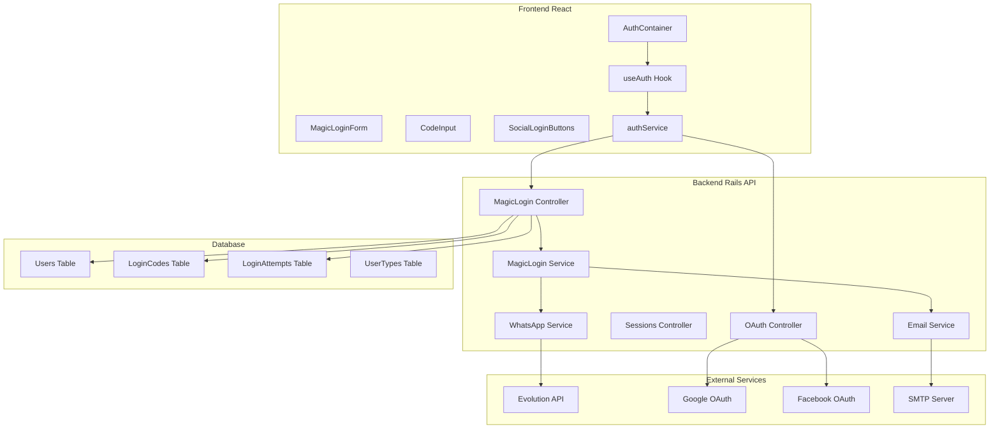
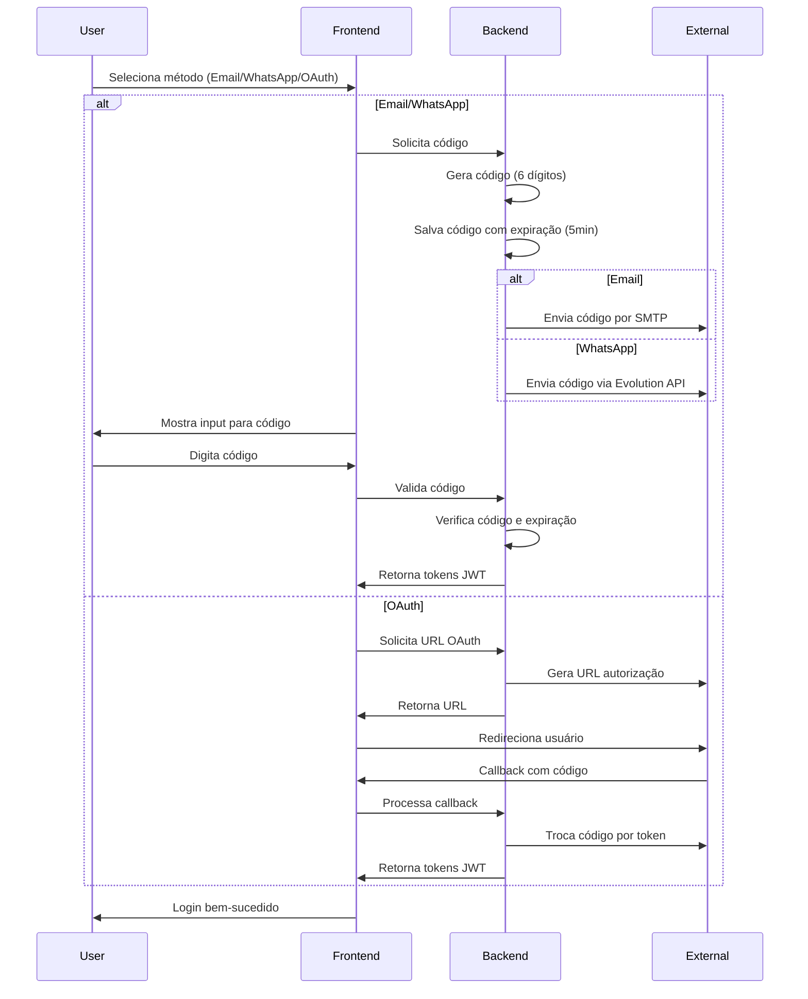

# Magic Login - Documentação Completa

## 📋 Índice de Documentação

Esta documentação fornece uma visão completa do sistema Magic Login implementado no projeto AI9, incluindo todos os aspectos técnicos, de segurança e operacionais.

### 📚 Documentos Criados

1. **[Documentação Técnica Principal](magic_login_documentation.md)**
   - Visão geral do sistema
   - Arquitetura e componentes
   - Fluxos de autenticação
   - Endpoints da API
   - Estrutura de banco de dados
   - Segurança e validações

2. **[Configuração Frontend React](magic_login_frontend_config.md)**
   - Estrutura de componentes
   - Componentes React detalhados
   - Serviços e hooks
   - Tipos e interfaces TypeScript
   - Estilos e temas
   - Testes de componentes

3. **[Guia de Testes e Validação](magic_login_testing_guide.md)**
   - Estrutura de testes
   - Testes de backend (RSpec)
   - Testes de frontend (Jest/React Testing Library)
   - Testes de segurança
   - Testes de integração

4. **[Guia de Configuração e Deployment](magic_login_deployment_guide.md)**
   - Configuração de ambiente
   - Banco de dados e Redis
   - Configuração de email e WhatsApp
   - OAuth (Google/Facebook)
   - Deployment com Capistrano e PM2
   - Nginx configuration
   - Monitoramento e manutenção

5. **[Guia de Segurança e Compliance](magic_login_security_guide.md)**
   - Princípios de segurança
   - Implementações de segurança
   - Proteção LGPD
   - Auditoria e logs
   - Gestão de vulnerabilidades
   - Incident response

---

## 🏗️ Arquitetura do Sistema

### Componentes Principais

### Fluxo de Autenticação

---

## 🔧 Implementação Backend

### Controllers Criados

1. **`Api::Auth::V1::MagicLogin`**
   - `POST /request_code` - Solicita código de acesso
   - `POST /validate_code` - Valida código e autentica
   - `GET /can_resend` - Verifica se pode reenviar código

2. **`Api::Auth::V1::OAuth`**
   - `GET /google_url` - URL de autorização Google
   - `GET /facebook_url` - URL de autorização Facebook
   - `POST /callback` - Processa callback OAuth

3. **`Api::Auth::V1::Sessions`**
   - `GET /status` - Verifica status da sessão
   - `POST /refresh` - Atualiza tokens
   - `DELETE /logout` - Encerra sessão

### Serviços Criados

1. **`Auth::MagicLoginService`**
   - Geração de códigos aleatórios
   - Criação de registros de código
   - Envio por email/WhatsApp
   - Validação de códigos

2. **`Auth::CodeValidationService`**
   - Validação de formato
   - Verificação de expiração
   - Controle de tentativas
   - Rate limiting

3. **`Auth::EmailService`**
   - Envio de códigos por email
   - Templates HTML responsivos
   - Tratamento de erros
   - Logs de envio

4. **`Auth::OauthService`**
   - Integração com provedores OAuth
   - Criação/atualização de usuários
   - Geração de tokens JWT
   - Registro de atividades

---

## 🎨 Implementação Frontend

### Componentes React Principais

1. **`AuthContainer`** - Container principal
2. **`MagicLoginForm`** - Seleção de método
3. **`IdentifierInput`** - Input de email/telefone
4. **`CodeInput`** - Input de 6 dígitos com contador
5. **`SocialLoginButtons`** - Botões OAuth

### Hooks Customizados

1. **`useAuth`** - Gerenciamento de autenticação
2. **`useCountdown`** - Contador regressivo

### Serviços

1. **`authService`** - Integração com API
2. **API Client** - Axios configurado

---

## 🛡️ Segurança Implementada

### Rate Limiting
- Máximo 5 requisições de código por minuto
- Máximo 10 tentativas de validação por IP
- Bloqueio após 3 tentativas de código incorreto

### Proteções
- Validação de formato (email/telefone)
- Expiração de código em 5 minutos
- Criptografia de dados sensíveis
- Headers de segurança (CSP, HSTS, etc.)
- Proteção CSRF
- Sanitização de inputs

### Auditoria
- Logs completos de todas as ações
- Registro de tentativas de login
- Monitoramento de atividades suspeitas
- Sistema de alertas

---

## 📊 Banco de Dados

### Tabelas Principais

1. **`users`** - Dados dos usuários
   - UUID como chave primária
   - Email, telefone, nome, avatar
   - Tipo de usuário (OG/cliente)
   - Timestamps e contadores

2. **`login_codes`** - Códigos de acesso
   - Código de 6 dígitos
   - Identificador (email/telefone)
   - Método (email/whatsapp)
   - Expiração em 5 minutos
   - Tentativas de validação

3. **`login_attempts`** - Histórico de tentativas
   - IP address
   - User agent
   - Sucesso/falha
   - Timestamps

4. **`user_types`** - Tipos de usuário
   - OG (super admin)
   - Cliente

---

## 🔍 Testes

### Cobertura de Testes

#### Backend (RSpec)
- **Controllers**: Testes de requisição HTTP
- **Services**: Testes unitários de serviços
- **Models**: Testes de validações e métodos
- **Segurança**: Testes de rate limiting e proteção

#### Frontend (Jest/React Testing Library)
- **Componentes**: Testes de renderização e interação
- **Hooks**: Testes de lógica customizada
- **Serviços**: Testes de integração com API
- **Utils**: Testes de funções auxiliares

### Critérios de Qualidade
- Cobertura mínima de 90%
- Todos os testes devem passar
- Sem vulnerabilidades críticas
- Performance aceitável (< 250ms)

---

## 🚀 Deployment

### Ambientes
- **Desenvolvimento**: Local com Docker
- **Staging**: Ambiente de testes
- **Produção**: Ambiente de produção

### Processo de Deployment
1. Executar testes
2. Build otimizado
3. Migrations do banco
4. Deploy com zero downtime
5. Verificação de health checks
6. Monitoramento pós-deployment

---

## 📈 Monitoramento

### Métricas Importantes
- Taxa de sucesso de login
- Tempo médio de autenticação
- Taxa de abandono por etapa
- Erros e exceções
- Performance da API

### Alertas
- Falhas de autenticação em massa
- Tentativas de brute force
- Erros críticos do sistema
- Performance degradada
- Vulnerabilidades detectadas

---

## 🔧 Manutenção

### Tarefas Regulares
- Limpeza de códigos expirados
- Backup do banco de dados
- Atualização de dependências
- Revisão de logs de segurança
- Monitoramento de performance

### Scripts de Manutenção
- Limpeza de dados expirados
- Anonimização de usuários
- Geração de relatórios
- Verificação de integridade

---

## 📋 Checklist Final

### Antes do Lançamento
- [ ] Todos os testes passando
- [ ] Segurança auditada
- [ ] Performance validada
- [ ] Documentação completa
- [ ] Monitoramento configurado
- [ ] Plano de rollback preparado
- [ ] Equipe treinada
- [ ] Suporte ao cliente preparado

### Pós-Lançamento
- [ ] Monitoramento ativo
- [ ] Métricas sendo coletadas
- [ ] Feedback dos usuários
- [ ] Issues sendo resolvidos
- [ ] Melhorias contínuas

---

## 🎯 Próximos Passos

### Melhorias Futuras
1. **Biometria** - Integração com autenticação biométrica
2. **2FA** - Two-factor authentication adicional
3. **Magic Link** - Links mágicos como alternativa
4. **Push Notifications** - Notificações push para mobile
5. **Analytics Avançado** - Dashboard de métricas detalhadas
6. **Machine Learning** - Detecção de fraudes com ML

### Integrações Planejadas
- Microsoft Azure AD
- Apple Sign In
- Telegram Login
- Discord OAuth
- GitHub OAuth

---

## 📞 Suporte

### Recursos de Suporte
- Documentação técnica completa
- Logs detalhados para debugging
- Sistema de tickets
- Monitoramento 24/7
- Equipe de segurança dedicada

### Escalonamento de Problemas
1. **Nível 1** - Suporte básico
2. **Nível 2** - Equipe técnica
3. **Nível 3** - Equipe de segurança
4. **Nível 4** - Desenvolvedores principais

---

**Documentação criada em:** $(date +%Y-%m-%d)  
**Versão:** 1.0.0  
**Última atualização:** $(date +%Y-%m-%d)  
**Responsável:** Equipe de Desenvolvimento AI9

---

*Esta documentação é parte integrante do sistema Magic Login e deve ser mantida atualizada conforme o sistema evolui.*