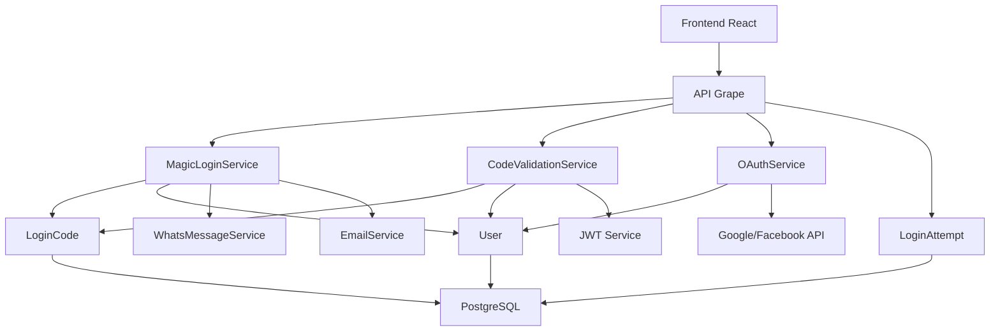
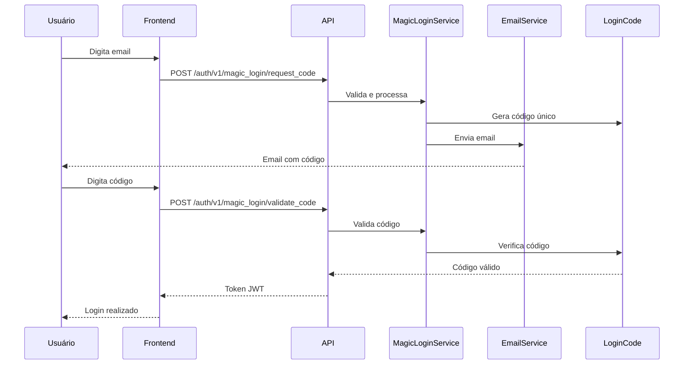
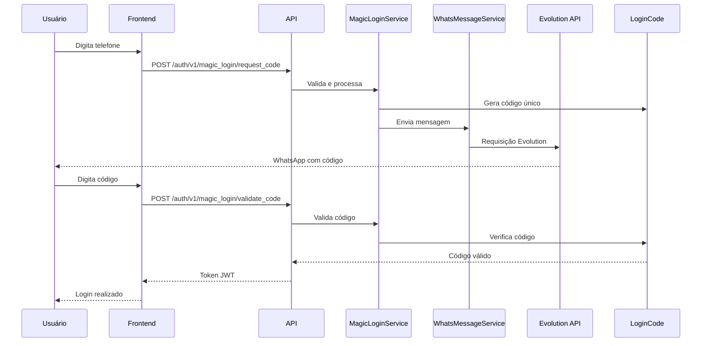
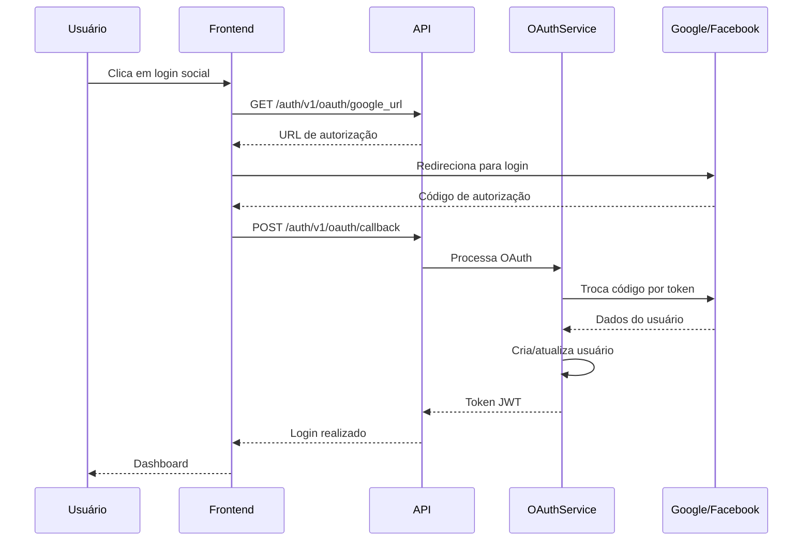

# Sistema de Magic Login - Documentação Técnica

## 1. Visão Geral

O sistema de Magic Login implementa autenticação sem senha através de códigos de acesso únicos enviados por email ou WhatsApp, além de suporte a login social via Google e Facebook (OAuth).

### Objetivos
- Eliminar o uso de senhas tradicionais
- Proporcionar experiência de login simplificada e segura
- Suportar múltiplos métodos de autenticação
- Garantir segurança através de rate limiting e logs

### Características Principais
- Códigos de 6 dígitos com validade de 5 minutos
- Rate limiting por IP e identificador
- Logs detalhados de todas as tentativas
- Criação automática de usuários
- Suporte a múltiplos provedores OAuth

## 2. Arquitetura

### 2.1 Diagrama de Componentes



### 2.2 Estrutura de Banco de Dados

#### Tabelas Principais

**users**
- `id` (UUID) - Identificador único
- `email` (string) - Email do usuário
- `phone` (string) - Telefone no formato DDI + DDD + número
- `name` (string) - Nome completo
- `avatar_url` (string) - URL do avatar
- `user_type_id` (UUID) - Tipo de usuário
- `provider` (string) - Provedor OAuth (google/facebook)
- `provider_uid` (string) - ID do provedor
- `last_login_at` (datetime) - Último login
- `login_count` (integer) - Contador de logins

**user_types**
- `id` (UUID) - Identificador único
- `name` (string) - Nome do tipo (OG, client)
- `description` (string) - Descrição
- `hierarchy_level` (integer) - Nível na hierarquia

**login_codes**
- `id` (UUID) - Identificador único
- `user_id` (UUID) - Usuário relacionado
- `destination` (string) - Email ou telefone destino
- `code` (string) - Código de 6 dígitos
- `method` (string) - Método (email/whatsapp)
- `expires_at` (datetime) - Data de expiração
- `used_at` (datetime) - Data de uso
- `attempts` (integer) - Tentativas de uso

**login_attempts**
- `id` (UUID) - Identificador único
- `identifier` (string) - Email, telefone ou ID OAuth
- `method` (string) - Método utilizado
- `ip_address` (inet) - Endereço IP
- `user_agent` (text) - User agent
- `success` (boolean) - Sucesso da tentativa
- `error_reason` (string) - Motivo do erro
- `user_id` (UUID) - Usuário (quando sucesso)

## 3. Fluxos de Autenticação

### 3.1 Magic Login via Email



### 3.2 Magic Login via WhatsApp



### 3.3 OAuth (Google/Facebook)



## 4. Endpoints da API

### 4.1 Magic Login

#### Solicitar Código
```http
POST /api/auth/v1/magic_login/request_code
Content-Type: application/json

{
  "identifier": "usuario@example.com",
  "method": "email"
}
```

**Resposta de Sucesso (200)**
```json
{
  "success": true,
  "message": "Código enviado para seu email",
  "code": "123456"  // Apenas em desenvolvimento
}
```

#### Validar Código
```http
POST /api/auth/v1/magic_login/validate_code
Content-Type: application/json

{
  "identifier": "usuario@example.com",
  "code": "123456",
  "method": "email"
}
```

**Resposta de Sucesso (200)**
```json
{
  "success": true,
  "message": "Login realizado com sucesso",
  "user": {
    "id": "uuid",
    "email": "usuario@example.com",
    "name": "Usuário Teste",
    "avatar_url": null,
    "user_type": "client",
    "last_login_at": "2024-01-01T00:00:00Z",
    "login_count": 1
  },
  "token": "jwt_token",
  "refresh_token": "refresh_token"
}
```

### 4.2 OAuth

#### Obter URL de Autorização
```http
GET /api/auth/v1/oauth/google_url?redirect_uri=http://localhost:3000/auth/callback
```

**Resposta (200)**
```json
{
  "url": "https://accounts.google.com/o/oauth2/v2/auth?...",
  "provider": "google"
}
```

#### Processar Callback
```http
POST /api/auth/v1/oauth/callback
Content-Type: application/json

{
  "provider": "google",
  "code": "auth_code_from_provider",
  "state": "csrf_token"
}
```

### 4.3 Sessões

#### Verificar Status
```http
GET /api/auth/v1/sessions/status
Authorization: Bearer jwt_token
```

#### Refresh Token
```http
POST /api/auth/v1/sessions/refresh
Content-Type: application/json

{
  "refresh_token": "refresh_token"
}
```

#### Logout
```http
DELETE /api/auth/v1/sessions/logout
Authorization: Bearer jwt_token
```

## 5. Segurança

### 5.1 Rate Limiting

**Por Identificador (15 minutos)**
- Máximo 5 tentativas falhas por identificador
- Bloqueio por 15 minutos após limite

**Por IP (1 hora)**
- Máximo 20 tentativas falhas por IP
- Bloqueio por 1 hora após limite

**Entre Códigos (1 minuto)**
- Mínimo 1 minuto entre solicitações de novo código
- Previne spam de códigos

### 5.2 Validações

**Código de Acesso**
- 6 dígitos numéricos
- Valido por 5 minutos
- Máximo 5 tentativas por código
- Único por destino/método

**Email**
- Formato válido (RFC 5322)
- Único no sistema
- Normalizado (lowercase, trim)

**Telefone**
- Apenas números
- Formato DDI + DDD + número
- Único no sistema

### 5.3 Logs e Auditoria

Todas as tentativas de login são registradas com:
- Identificador (email/telefone/oauth_id)
- Método de autenticação
- Endereço IP
- User agent
- Sucesso/falha
- Motivo do erro
- Timestamp

## 6. Serviços Implementados

### 6.1 MagicLoginService
- Processa solicitações de código
- Envia códigos via email/WhatsApp
- Cria usuários quando necessário

### 6.2 CodeValidationService
- Valida códigos de acesso
- Realiza login do usuário
- Gera tokens JWT

### 6.3 OAuthService
- Processa logins sociais
- Integração com Google/Facebook
- Criação automática de usuários

### 6.4 EmailService
- Envio de emails com códigos
- Templates HTML responsivos
- Logs de envio

### 6.5 WhatsMessageService
- Integração com Evolution API
- Envio de mensagens via WhatsApp
- Formatação de mensagens

## 7. Frontend React

### 7.1 Componentes Necessários

**MagicLoginForm**
- Formulário de solicitação de código
- Validação de campos
- Seletor de método (email/WhatsApp)

**CodeValidationForm**
- Input de 6 dígitos
- Validação automática
- Timer de expiração

**SocialLoginButtons**
- Botões Google/Facebook
- Redirecionamento OAuth
- Tratamento de callback

**LoginFlowManager**
- Gerenciamento de estado
- Transição entre etapas
- Tratamento de erros

### 7.2 Integração com API

```typescript
// Serviço de autenticação
class AuthService {
  async requestMagicCode(identifier: string, method: 'email' | 'whatsapp') {
    return api.post('/auth/v1/magic_login/request_code', {
      identifier,
      method
    });
  }

  async validateCode(identifier: string, code: string, method: string) {
    return api.post('/auth/v1/magic_login/validate_code', {
      identifier,
      code,
      method
    });
  }

  async getOAuthUrl(provider: 'google' | 'facebook', redirectUri: string) {
    return api.get(`/auth/v1/oauth/${provider}_url`, {
      params: { redirect_uri: redirectUri }
    });
  }

  async handleOAuthCallback(provider: string, code: string) {
    return api.post('/auth/v1/oauth/callback', {
      provider,
      code
    });
  }
}
```

## 8. Configuração e Deploy

### 8.1 Variáveis de Ambiente

```bash
# Evolution API
EVOLUTION_BASE_URL=https://api.evolution.com
EVOLUTION_API_KEY=your_api_key

# OAuth (quando configurado)
GOOGLE_CLIENT_ID=your_google_client_id
GOOGLE_CLIENT_SECRET=your_google_client_secret
FACEBOOK_APP_ID=your_facebook_app_id
FACEBOOK_APP_SECRET=your_facebook_app_secret

# Email (quando configurado)
SMTP_HOST=smtp.example.com
SMTP_PORT=587
SMTP_USER=your_user
SMTP_PASS=your_password
```

### 8.2 Migrações

```bash
# Executar migrações
rails db:migrate

# Popular dados iniciais
rails db:seed
```

### 8.3 Testes

```bash
# Executar testes
bundle exec rspec

# Cobertura de testes (mínimo 90%)
bundle exec rspec --format documentation
```

## 9. Manutenção e Monitoramento

### 9.1 Limpeza de Dados

**Códigos Expirados**
- Executar diariamente para remover códigos antigos
- Manter histórico por 30 dias

**Logs de Tentativas**
- Arquivar logs antigos após 90 dias
- Manter agregações para análise

### 9.2 Métricas Importantes

**Taxa de Sucesso por Método**
- Email: monitorar bounce rate
- WhatsApp: monitorar delivery rate
- OAuth: monitorar completion rate

**Performance**
- Tempo de envio de códigos
- Tempo de validação
- Taxa de erros por endpoint

### 9.3 Alertas

**Situações Críticas**
- Alta taxa de tentativas falhas (possível ataque)
- Falha no envio de códigos
- Erros de validação em massa

## 10. Considerações Finais

### 10.1 Próximos Passos

1. **Implementar JWT completo** com refresh tokens
2. **Configurar OAuth real** com Google/Facebook
3. **Implementar ActionMailer** para emails em produção
4. **Adicionar 2FA** para usuários admin
5. **Implementar remember me** com cookies seguros

### 10.2 Melhorias de Segurança

1. **Captcha** para prevenir automação
2. **Device fingerprinting** para detecção de fraudes
3. **Notificações** de login em novos dispositivos
4. **Análise comportamental** para detectar padrões suspeitos

### 10.3 Escalabilidade

1. **Cache de códigos** em Redis
2. **Fila para envio** de mensagens
3. **Rate limiting distribuído**
4. **Sharding de dados** por tenant

---

**Documentação gerada em**: $(date)
**Versão**: 1.0.0
**Status**: Em desenvolvimento