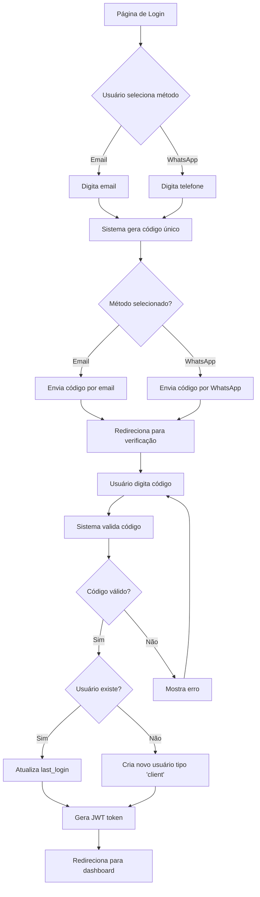
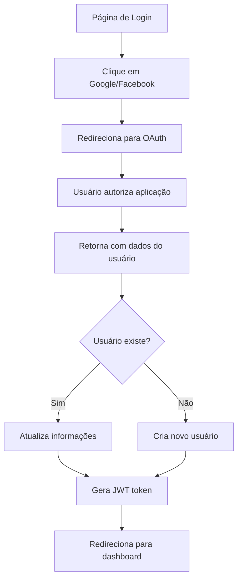

## 1. Product Overview

Sistema de autenticação moderno e seguro que elimina a necessidade de senhas tradicionais. O Magic Login permite que usuários acessem o sistema através de códigos únicos enviados por WhatsApp ou email, além de login social com Google e Facebook. O sistema prioriza segurança, usabilidade e experiência mobile-first.

**Problema resolvido:** Eliminação de senhas esquecidas, aumento de segurança através de autenticação multifatorial implícita, e simplificação do processo de login para melhor conversão e retenção de usuários.

**Público-alvo:** Usuários finais do sistema que buscam uma experiência de login rápida, segura e sem complicações de gerenciamento de senhas.

## 2. Core Features

### 2.1 User Roles

| Role | Registration Method | Core Permissions |
|------|-------------------|------------------|
| OG (Super Admin) | Manual creation by system | Full system access, user management, system configuration |
| Client | Auto-creation via magic login | Access to user dashboard, profile management, basic features |

### 2.2 Feature Module

Nosso sistema de Magic Login consiste nas seguintes páginas principais:

1. **Página de Login**: Seletor de método (Email/WhatsApp), campo de entrada, botões sociais
2. **Página de Verificação**: Input de 6 dígitos para código, opções de reenvio e voltar
3. **Dashboard Principal**: Página inicial após autenticação bem-sucedida

### 2.3 Page Details

| Page Name | Module Name | Feature description |
|-----------|-------------|---------------------|
| Login Page | Method Selector | Alternar entre Email e WhatsApp com visual de pills segmentados, mostrar ícones apropriados para cada método |
| Login Page | Input Field | Campo de entrada dinâmico que muda placeholder e tipo baseado no método selecionado (email ou telefone) |
| Login Page | Submit Button | Botão primário que envia código via método selecionado, com ícone correspondente e loading state |
| Login Page | Social Divider | Divisor visual com texto "OU CONTINUE COM" e botões laterais para Google e Facebook |
| Login Page | Social Buttons | Botões secundários para login social com Google e Facebook, ícones oficiais dos provedores |
| Code Verification | Header Info | Exibir destinatário do código (email ou telefone mascarado) para confirmação do usuário |
| Code Verification | Code Input | Seis campos de input individuais para código de 6 dígitos, auto-focus e navegação por tab |
| Code Verification | Verify Button | Botão primário habilitado apenas quando todos os 6 dígitos forem preenchidos |
| Code Verification | Resend Link | Link para reenviar código com cooldown de 30 segundos entre reenvios |
| Code Verification | Back Button | Botão para retornar à página de seleção de método |

## 3. Core Process

### 3.1 Fluxo de Login via Email/WhatsApp

### 3.2 Fluxo de Login Social

## 4. User Interface Design

### 4.1 Design Style

**Cores Primárias:**
- Background: `from-slate-900 to-slate-800` (gradiente escuro)
- Card Background: `bg-slate-900/90` (quase preto com transparência)
- Texto Principal: `text-white`
- Texto Secundário: `text-gray-400`
- Acentos: `bg-white` (botões primários)

**Botões:**
- Primário: Fundo branco com texto escuro, bordas arredondadas (rounded-lg)
- Secundário: Fundo slate-800 com texto branco, hover slate-700
- Estado Desabilitado: Opacidade reduzida (opacity-50)

**Tipografia:**
- Fonte: Sistema padrão (sans-serif)
- Títulos: text-2xl, font-medium
- Texto normal: text-sm ou base
- Placeholder: text-gray-500

**Layout:**
- Card centralizado com max-w-md (448px)
- Espaçamento consistente (mb-6, p-8)
- Bordas arredondadas (rounded-2xl)

### 4.2 Page Design Overview

| Page Name | Module Name | UI Elements |
|-----------|-------------|-------------|
| Login Page | Method Selector | Pills segmentados com ícones, transição suave de cores, estado ativo/inativo claro |
| Login Page | Input Field | Background slate-800, borda slate-700, texto branco, placeholder gray-500, focus ring |
| Login Page | Submit Button | Background branco, texto slate-900, hover gray-100, loading spinner quando processando |
| Login Page | Social Divider | Linhas slate-700, texto gray-400 uppercase pequeno, centrado com background do card |
| Login Page | Social Buttons | Background slate-800, texto branco, ícones oficiais, hover slate-700, bordas arredondadas |
| Code Verification | Code Input | Seis quadrados slate-800 com borda slate-700, font-mono, texto branco, auto-focus sequencial |
| Code Verification | Verify Button | Mesmo estilo do botão primário, desabilitado até código completo |
| Code Verification | Resend Link | Texto gray-400 pequeno, hover:text-white, underline opcional |
| Code Verification | Back Button | Estilo secundário slate-800, texto branco, hover slate-700 |

### 4.3 Responsiveness

**Desktop-first approach:**
- Layout fixo centralizado em telas grandes
- Card com largura máxima de 448px
- Altura mínima de tela cheia (min-h-screen)
- Adaptação automática para mobile através de flexbox e grid

**Mobile considerations:**
- Touch-friendly buttons (min-height 44px)
- Inputs com tamanho adequado para dedos
- Teclado numérico para código de verificação
- Scroll prevention quando teclado aberto

## 5. Requisitos Técnicos Adicionais

### 5.1 Segurança
- Códigos de 6 dígitos numéricos
- Validade de 5 minutos
- Máximo 3 tentativas por código
- Rate limiting: 5 tentativas por minuto
- Logs de todas as tentativas com IP e user agent
- JWT com expiração de 15 minutos
- Refresh token com expiração de 7 dias

### 5.2 Performance
- Tempo de envio de código < 2 segundos
- Tempo de verificação < 500ms
- Loading states em todos os botões
- Debounce de 300ms no input de código
- Lazy loading de componentes sociais

### 5.3 Acessibilidade
- Navegação por teclado completa
- Labels ARIA apropriados
- Contraste WCAG AA
- Focus visible em todos elementos interativos
- Suporte a leitores de tela

### 5.4 Internacionalização
- Textos em português (pt-BR)
- Preparação para múltiplos idiomas
- Formatação de telefone local
- Formatação de data/hora local

## 6. Métricas e Analytics

### 6.1 Eventos de Tracking
- Método de login selecionado
- Taxa de sucesso por método
- Tempo médio de verificação
- Taxa de reenvio de código
- Taxa de abandono por etapa

### 6.2 KPIs de Sucesso
- Tempo médio de login < 30 segundos
- Taxa de sucesso de login > 95%
- Taxa de abandono < 10%
- NPS de experiência de login > 8

## 7. Casos de Uso Especiais

### 7.1 Desenvolvimento
- Em ambiente de desenvolvimento, mostrar toast com código para facilitar testes
- Console log com informações de debug
- Bypass de rate limiting para testes automatizados

### 7.2 Erros e Estados
- Código inválido: mensagem clara e opção de reenvio
- Código expirado: informar tempo limite e permitir novo código
- Erro de rede: mensagem de erro com retry automático
- Serviço indisponível: fallback para outro método

### 7.3 Segurança Avançada
- Detecção de tentativas suspeitas
- Bloqueio temporário após múltiplas falhas
- Notificação de novo dispositivo/